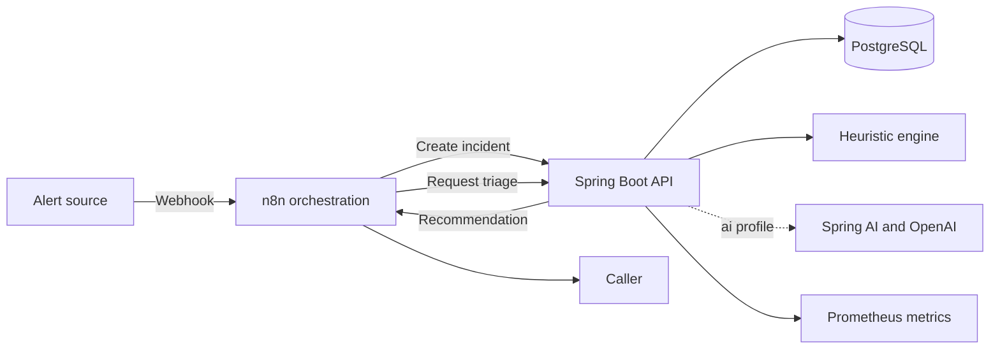

# OpsPilot Agent

OpsPilot is an open-source incident triage agent built for enterprise-style operations. An n8n workflow accepts an alert, a Spring Boot service persists it, and a triage engine returns a priority, category, response checklist, confidence score, and human-review decision.

The default engine is deterministic and needs no paid API. Activate the `ai` Spring profile to use Spring AI with OpenAI structured output.

## Architecture



## Stack

- Java 21, Spring Boot 4.1, Spring Data JPA, Spring Security, Flyway
- Spring AI 2.0 with schema-validated model output
- n8n 2.35 workflow orchestration
- PostgreSQL 17, Docker Compose
- OpenAPI/Swagger, Actuator, Prometheus
- JUnit 5, AssertJ, GitHub Actions, Dependabot

## Run locally

Requirements: Docker with Compose support.

```bash
cp .env.example .env
docker compose up --build
```

Open n8n at [http://localhost:5678](http://localhost:5678), complete its local owner setup, open **OpsPilot Incident Triage**, and publish the workflow. Swagger UI is available at [http://localhost:8080/swagger-ui.html](http://localhost:8080/swagger-ui.html).

Send a sample alert:

```bash
curl --request POST http://localhost:5678/webhook/incident-triage \
  --header 'Content-Type: application/json' \
  --data '{
    "title": "Authentication outage",
    "description": "All users receive unauthorized errors after token rotation.",
    "source": "grafana",
    "reportedSeverity": "CRITICAL"
  }'
```

The response includes the stored incident and its triage recommendation:

```json
{
  "status": "TRIAGED",
  "priority": "P1",
  "category": "security",
  "requiresHumanReview": true,
  "triageEngine": "heuristic-v1"
}
```

## Use Spring AI

Set `OPENAI_API_KEY`, then start the API with the `ai` profile:

```bash
SPRING_PROFILES_ACTIVE=ai docker compose up --build
```

`OPENAI_MODEL` defaults to `gpt-5-mini`. The agent requests a typed recommendation and validates the returned schema before persisting it. The prompt explicitly prevents the model from claiming actions were executed.

## Direct API

All `/api/**` endpoints require `X-API-Key`. The development key comes from `.env`; replace it outside local development.

```bash
curl http://localhost:8080/api/v1/incidents \
  --header 'X-API-Key: dev-only-change-me'
```

| Method | Path | Purpose |
| --- | --- | --- |
| `POST` | `/api/v1/incidents` | Validate and persist an incident |
| `POST` | `/api/v1/incidents/{id}/triage` | Run the selected triage engine |
| `GET` | `/api/v1/incidents/{id}` | Retrieve one incident |
| `GET` | `/api/v1/incidents?limit=25` | List recent incidents |

## Development

Run the test suite with the included Maven wrapper:

```bash
./mvnw verify
```

The default test profile uses H2 in PostgreSQL compatibility mode. Runtime schema changes belong in versioned Flyway migrations.

## Production notes

- Replace the development API key and n8n encryption key.
- Store the API key in an n8n Header Auth credential instead of exposing environment variables to workflow expressions.
- Put n8n and the API behind TLS, restrict Swagger/Actuator exposure, and use a managed PostgreSQL instance.
- Keep human approval for P1/P2 response actions. OpsPilot recommends actions; it does not execute remediation.
- Add your organization-specific taxonomy and runbooks before operational use.

## License

OpsPilot source code and workflow files are licensed under MIT. n8n is a separate dependency distributed under its own [Sustainable Use License](https://github.com/n8n-io/n8n/blob/master/LICENSE.md).
